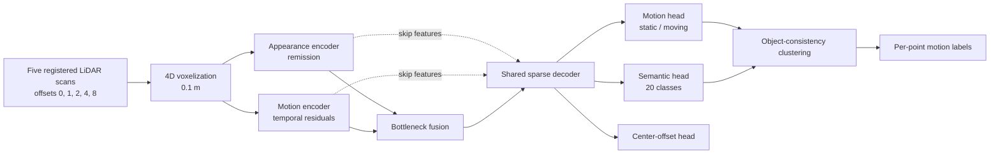

# SparseUNet4D

SparseUNet4D is a 4D sparse-convolutional network for LiDAR moving-object
segmentation (MOS). It combines appearance and temporal-motion evidence in
separate encoders, fuses them in a shared decoder, and applies an object-level
consistency head so points belonging to the same object receive coherent motion
predictions.

The repository includes training and evaluation code for SemanticKITTI, a
streaming Python API, a ROS 2 node, KITTI replay tools, and Husky/Gazebo
deployment instructions.

> Research prototype: validated in simulation and on the documented Jetson
> robot setup, but not certified for safety-critical vehicle control.

## Architecture



For each reference scan, four earlier scans are registered into its coordinate
frame. Signed temporal residuals describe motion while remission supplies
appearance. Two sparse 4D encoders keep these signals separate; their bottleneck
and skip features are fused by a shared decoder. The cluster-consistency head
pools reference-frame foreground voxels and refines their motion logits at the
object level.

## Results

On SemanticKITTI validation sequence 08, the released checkpoint records
**83.66% point-level moving IoU** at its selected threshold of **0.9**. This is a
validation result, not a SemanticKITTI test-server result.

Runtime was measured on 320 consecutive sequence-08 scans (about 123k input
points and 302k five-frame voxels per scan):

| Hardware | Measurement | Latency | Throughput |
|---|---:|---:|---:|
| RTX 3090 | network only, 100 scans | 186.7 ms mean | 5.3 Hz |
| RTX 3090 | end to end, 300 scans after 20 warm-up | 494.1 ms mean | 2.0 Hz |

End to end includes CPU preprocessing, GPU inference, and voxel-to-point
mapping. See [RESULTS.md](RESULTS.md) for experiments and limitations.

## Choose one setup path

Docker and the source installation are alternatives. Do not complete both for
the same machine.

| Goal | Use this guide | Clone repository? | Install Python/ML packages on host? |
|---|---|---:|---:|
| Run the published image on an `x86_64` PC or Gazebo | [x86/Gazebo Docker](README_HUSKY_GAZEBO.md) | No | No |
| Run on Jetson AGX Orin / JetPack 6.2 | [Jetson Docker](README_JETSON_ORIN.md) | Yes, only to build the image | No |
| Train, evaluate, modify code, or run without Docker | [Source installation](INSTALLATION.md), then [source deployment](DEPLOYMENT.md) | Yes | Yes |

Both Docker images are self-contained and include ROS 2 Humble, PyTorch,
MinkowskiEngine, the source, configuration, and released checkpoint. The
Jetson workflow builds locally because it uses the JetPack/L4T runtime from the
target device; the regular `latest` image is `amd64` and cannot run on Jetson.

For the source-installation path, the download script installs the checkpoint
at:

```text
checkpoints/sparseunet4d_semantickitti/best.pt
```

Docker images already contain it. The standalone file is distributed as a
GitHub Release asset because its 141 MB size exceeds GitHub's normal per-file
repository limit. Do not commit it directly to Git.

## Repository layout

```text
configs/                    model, training, and deployment configurations
deploy/                     download, replay, benchmark, and setup utilities
scripts/                    training and robustness scripts
sparseunet4d/datasets/      SemanticKITTI loading and temporal features
sparseunet4d/models/        sparse backbone, dual branch, heads, and losses
mos_inference.py            ROS-independent streaming inference API
mos_node.py                 ROS 2 streaming node
INSTALLATION.md             beginner installation guide
DEPLOYMENT.md               running and deployment guide
README_HUSKY_GAZEBO.md      isolated Docker deployment on Husky/Gazebo
README_JETSON_ORIN.md       Jetson AGX Orin Docker build and robot run guide
```

## Training and evaluation

After setting SemanticKITTI paths in the selected YAML file:

```bash
export SU4D_BACKEND=me
export PYTHONPATH="$PWD:${PYTHONPATH:-}"

python scripts/train.py \
  --config configs/pretrained_semantickitti.yaml \
  --save-dir runs/my_experiment
```

For official point-level validation, provide the MOS label mapping required by
the evaluator:

```bash
python eval_mos_official.py \
  --config configs/pretrained_semantickitti.yaml \
  --ckpt checkpoints/sparseunet4d_semantickitti/best.pt \
  --mos-yaml /path/to/mos-label-mapping.yaml \
  --point-level \
  --threshold 0.9
```

## Citation and license

The paper citation and software license have not yet been added. Add both before
an archival public release so users know how to cite the work and what reuse is
permitted.
